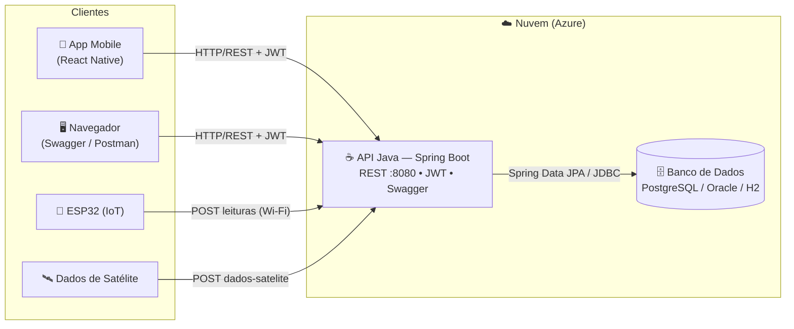
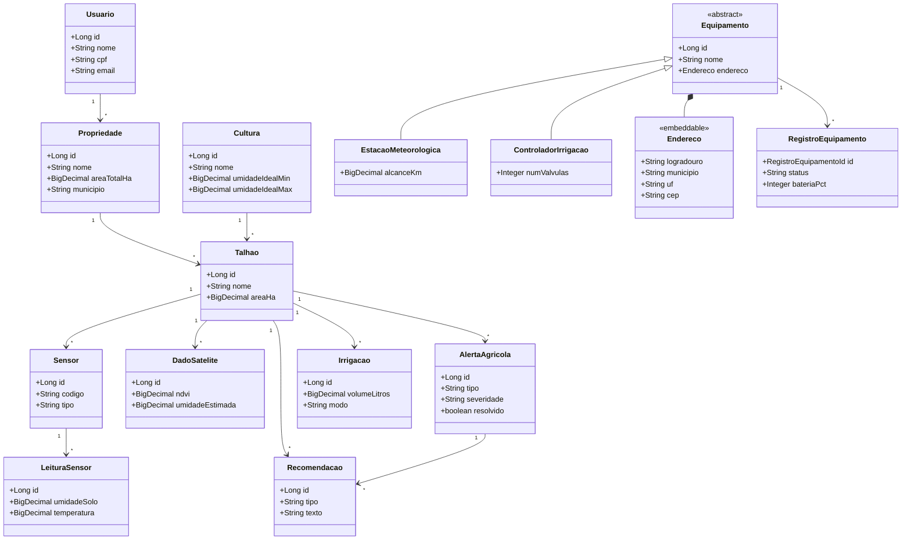
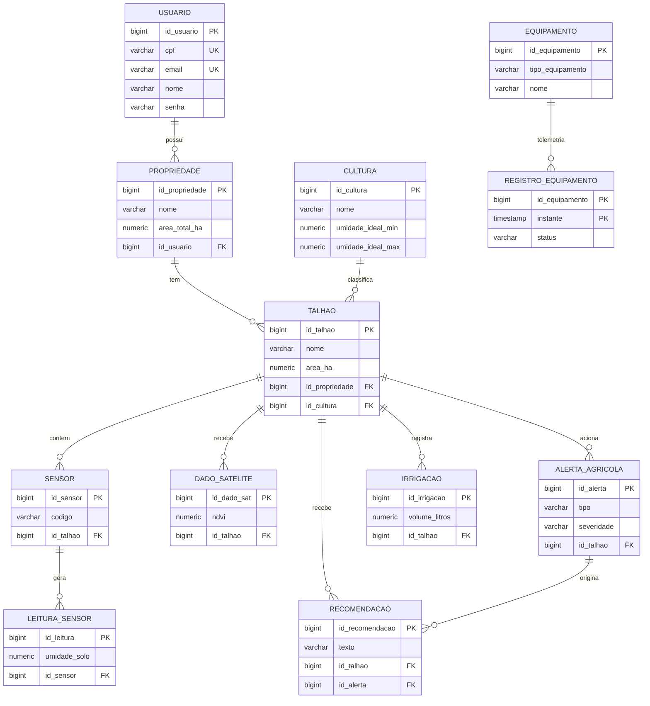

# 🛰️🌱 AgroSat — API Java (Spring Boot 3)

API REST da disciplina **Java Advanced** — Global Solution FIAP 2026/1 (tema: **economia espacial**).
**AgroSat** é uma solução de **agricultura de precisão**: cruza **dados de satélite** (NDVI, umidade
estimada, previsão de chuva) com **sensores ESP32 no campo** (umidade do solo, temperatura) e gera
**alertas e recomendações de irrigação** por talhão. ODS 2, 8, 9 e 13.

## 👥 Integrantes (Grupo 4 — Turma 2TDSR)
- RM 565733 — Erick Bernardes Bradaschia
- RM 564054 — Gabriel Santos Claudino
- RM 565060 — Jonathan Moreira Gomes
- RM 566067 — Kaiky de Oliveira Silva
- RM 559523 — Lucas Fortes de Lima

---

## 📑 Sumário
1. [Links da entrega](#-links-da-entrega)
2. [Proposta da solução](#-proposta-da-solução)
3. [Funcionalidades do sistema](#-funcionalidades-do-sistema)
4. [Arquitetura](#️-arquitetura)
5. [Diagrama de Classes](#-diagrama-de-classes)
6. [Diagrama Entidade-Relacionamento (ER)](#️-diagrama-entidade-relacionamento-er)
7. [Endpoints da API](#-endpoints-da-api)
8. [Testes (Postman)](#-testes-postman)
9. [Como executar](#️-como-executar)
10. [DevOps — rodar em nuvem (2 containers)](#-devops--rodar-em-nuvem-2-containers)
11. [Tecnologias](#️-tecnologias)

---

## 📌 Links da entrega

| Item | Link |
|------|------|
| 🌐 **Deploy público (Swagger)** | https://agrosat-api-566067.azurewebsites.net/swagger-ui/index.html |
| 📄 **Documentação da API (OpenAPI)** | https://agrosat-api-566067.azurewebsites.net/v3/api-docs |
| 🎥 **Vídeo de apresentação (YouTube)** | https://youtu.be/pcSSx7eJQ9g |
| 🎤 **Vídeo Pitch (YouTube)** | https://youtu.be/D5cTgb1hQpg |
| 💻 **Repositório** | https://github.com/kaiky06301/agrosat-api-java |
| 🧪 **Coleção Postman** | [`postman/AgroSat.postman_collection.json`](postman/AgroSat.postman_collection.json) |

**Login de teste:** `admin@agrosat.com.br` / `123456`

---

## 🎯 Proposta da solução

O produtor rural não consegue saber, no olho, qual parte da fazenda está com sede — e água é o maior
custo e risco do agronegócio. O **AgroSat** resolve isso unindo **dois olhares**:

- **De cima (satélite):** NDVI (saúde da planta), umidade estimada e previsão de chuva por talhão.
- **De baixo (IoT/ESP32):** umidade do solo, temperatura e luminosidade medidas no campo.

A **API Java** recebe esses dados, aplica a regra de negócio (faixa ideal por cultura) e gera
**alertas automáticos** (seca / excesso) e **recomendações de irrigação** por talhão. O app mobile
consome essa API; a disciplina de DevOps a conteineriza e publica em nuvem.

---

## ✨ Funcionalidades do sistema

- **Autenticação e segurança:** login com **JWT** (Spring Security); rotas protegidas exigem token.
- **Cadastro de usuários** (produtores) com validação de CPF/e-mail únicos.
- **Gestão de propriedades** (fazendas) — CRUD completo, vinculadas ao usuário.
- **Gestão de talhões** — CRUD; cada talhão pertence a uma propriedade e a uma cultura.
- **Culturas** com faixas ideais de umidade/temperatura e ciclo (dias).
- **Sensores e leituras** — registro de leituras de campo (umidade do solo, temperatura, etc.).
- **Dados de satélite** — NDVI, umidade estimada e índice de chuva por talhão.
- **Alertas agrícolas** — gerados a partir das leituras/dados (seca, excesso), com severidade.
- **Recomendações** — orientações de irrigação ligadas a um alerta.
- **Irrigações** — registro de eventos de irrigação (início, fim, volume, modo).
- **Equipamentos de campo** — estações meteorológicas e controladores de irrigação (modelagem com
  **herança**, **endereço embutido** e **telemetria com chave composta**).
- **Documentação interativa** via Swagger/OpenAPI, **HATEOAS** (links nos recursos) e **CORS** habilitado.

---

## 🏗️ Arquitetura

A API segue **arquitetura em camadas** (Controller → Service → Repository → Entity), com DTOs (Java
Records) na fronteira e segurança por filtro JWT. Publicada em **nuvem (Azure)**.



**Camadas (pacote `br.com.fiap.agrosat`):**

```
controller/   -> endpoints REST (/api/...), HATEOAS nos recursos
service/      -> regras de negócio e mapeamento DTO <-> entidade
repository/   -> Spring Data JPA (JpaRepository)
entity/       -> entidades JPA (tabelas + modelagem avançada)
dto/          -> Java Records de Request/Response + Bean Validation
security/     -> JwtService, filtro JWT, UserDetailsService
config/       -> SecurityConfig (CORS), OpenApiConfig, DataSeeder
exception/    -> tratamento global de erros (respostas padronizadas)
```

---

## 🧩 Diagrama de Classes

Relacionamentos do domínio + **modelagem avançada** (herança em `Equipamento`, `@Embedded Endereco`,
chave composta em `RegistroEquipamento`).



---

## 🗄️ Diagrama Entidade-Relacionamento (ER)



> **Modelagem avançada (JPA):** `EQUIPAMENTO` usa **herança SINGLE_TABLE** com coluna discriminadora
> (`tipo_equipamento`); o **Endereço** é um objeto de valor **`@Embedded`**; e `REGISTRO_EQUIPAMENTO`
> tem **chave composta** (`@EmbeddedId` = id_equipamento + instante).

---

## 🔌 Endpoints da API

Todos sob `/api`. Exceto `auth`, exigem **JWT** (`Authorization: Bearer <token>`).

| Recurso | Verbos | Descrição |
|---------|--------|-----------|
| `/api/auth/login` | POST | Autentica e retorna o token JWT |
| `/api/usuarios` | GET, POST, PUT, DELETE | CRUD de usuários |
| `/api/propriedades` | GET, POST, PUT, DELETE | CRUD de fazendas (**com HATEOAS**) |
| `/api/talhoes` | GET, POST, PUT, DELETE | CRUD de talhões (**com HATEOAS**) |
| `/api/culturas` | GET, POST, PUT, DELETE | CRUD de culturas |
| `/api/sensores` | GET, POST, PUT, DELETE | CRUD de sensores |
| `/api/leituras` | GET, POST, PUT, DELETE | Leituras de sensores |
| `/api/dados-satelite` | GET, POST, PUT, DELETE | Dados de satélite |
| `/api/alertas` | GET, POST, PUT, DELETE | Alertas agrícolas |
| `/api/recomendacoes` | GET, POST, PUT, DELETE | Recomendações |
| `/api/irrigacoes` | GET, POST, PUT, DELETE | Eventos de irrigação |
| `/api/equipamentos` | GET | Equipamentos (demonstra **herança**) |

> Verbos HTTP, **HTTP Status Codes** (201/200/204/400/404) e **HATEOAS** seguem os padrões REST.
> Documentação completa e interativa no **Swagger** (link acima).

---

## 🧪 Testes (Postman)

Coleção pronta no repositório: [`postman/AgroSat.postman_collection.json`](postman/AgroSat.postman_collection.json).

**Como usar:**
1. Postman → **Import** → selecione o arquivo `postman/AgroSat.postman_collection.json`.
2. Rode **"1. Auth - Login"** — o token JWT é salvo automaticamente na variável `{{token}}`.
3. Rode as demais requisições na ordem (CRUD de propriedades, validação, equipamentos…).
4. A variável `{{baseUrl}}` já aponta para o deploy em nuvem (troque para `http://localhost:8080` se rodar local).

**Exemplos (CRUD completo):**

```http
### 1) Login  ->  200 + token
POST {{baseUrl}}/api/auth/login
Content-Type: application/json
{ "email": "admin@agrosat.com.br", "senha": "123456" }

### 2) Criar (Create)  ->  201 Created (resposta com _links HATEOAS)
POST {{baseUrl}}/api/propriedades
Authorization: Bearer {{token}}
{ "idUsuario": 1, "nome": "Fazenda Boa Vista", "municipio": "Ribeirao Preto", "uf": "SP", "areaTotalHa": 120.5 }

### 3) Listar (Read)  ->  200
GET {{baseUrl}}/api/propriedades        Authorization: Bearer {{token}}

### 4) Atualizar (Update)  ->  200
PUT {{baseUrl}}/api/propriedades/1
Authorization: Bearer {{token}}
{ "idUsuario": 1, "nome": "Fazenda Boa Vista (editada)", "areaTotalHa": 99.9 }

### 5) Excluir (Delete)  ->  204 No Content
DELETE {{baseUrl}}/api/propriedades/1   Authorization: Bearer {{token}}

### 6) Validação  ->  400 Bad Request (campo obrigatório)
POST {{baseUrl}}/api/propriedades
Authorization: Bearer {{token}}
{ "idUsuario": 1 }
```

---

## ▶️ Como executar

### Local (perfil H2 — sem instalar banco)
```bash
git clone https://github.com/kaiky06301/agrosat-api-java.git
cd agrosat-api-java
mvn spring-boot:run -Dspring-boot.run.profiles=h2
# Swagger: http://localhost:8080/swagger-ui/index.html
# Login:   admin@agrosat.com.br / 123456 (criado automaticamente pelo seeder)
```

### Perfis disponíveis
- `h2` — banco em memória (dev/teste rápido); cria o usuário admin automaticamente.
- `postgres` — PostgreSQL (deploy em nuvem / containers).
- `oracle` — Oracle FIAP (preencher credenciais em `application-oracle.properties`).

---

## 🐳 DevOps — rodar em nuvem (2 containers)

Ambiente conteinerizado com **2 containers Docker** (API + PostgreSQL) na **mesma rede**, em **VM Linux
na Azure** (não localhost). Imagem da aplicação gerada via Dockerfile (usuário **não-root**).

```bash
# 1) Imagem própria da aplicação
docker build -t agrosat-api:566067 .

# 2) Rede + volume nomeado
docker network create agrosat-net-566067
docker volume  create pgdata-566067

# 3) Container do BANCO (Postgres, volume nomeado, RM no nome)
docker run -d --name agrosat-db-566067 --network agrosat-net-566067 \
  -e POSTGRES_DB=agrosat -e POSTGRES_USER=agrosat -e POSTGRES_PASSWORD=agrosat2026 \
  -v pgdata-566067:/var/lib/postgresql/data -p 5432:5432 postgres:16

# 4) Container da APLICAÇÃO (imagem própria, não-root, mesma rede, RM no nome)
docker run -d --name agrosat-app-566067 --network agrosat-net-566067 \
  -e SPRING_PROFILES_ACTIVE=postgres \
  -e SPRING_DATASOURCE_URL=jdbc:postgresql://agrosat-db-566067:5432/agrosat \
  -e SPRING_DATASOURCE_USERNAME=agrosat -e SPRING_DATASOURCE_PASSWORD=agrosat2026 \
  -e AGROSAT_JWT_SECRET=<sua-chave-256-bits> -e JAVA_OPTS="-Xms128m -Xmx384m" \
  -p 8080:8080 agrosat-api:566067

# 5) Evidências
docker ps
docker exec agrosat-app-566067 sh -c "pwd; whoami"   # /app | agrosat (não-root)
docker exec -it agrosat-db-566067 psql -U agrosat -d agrosat \
  -c "SELECT p.nome AS fazenda, u.nome AS dono FROM propriedade p JOIN usuario u ON u.id_usuario = p.id_usuario;"
```

> Alternativa: `docker compose up -d --build` (ver [`docker-compose.yml`](docker-compose.yml)).
> Diagrama macro: [`arquitetura-devops.drawio`](arquitetura-devops.drawio).

---

## 🛠️ Tecnologias

**Java 17** · **Spring Boot 3.3** · Spring Web · **Spring Data JPA / Hibernate** · **Spring Security + JWT (jjwt)** ·
**Spring HATEOAS** · Bean Validation · **Lombok** · **Spring Boot DevTools** · **springdoc/OpenAPI (Swagger)** ·
Maven · **Docker** · **PostgreSQL / H2 / Oracle**.

---

Global Solution FIAP 2026/1 · Economia Espacial 🛰️🌱 · ODS 2, 8, 9, 13
